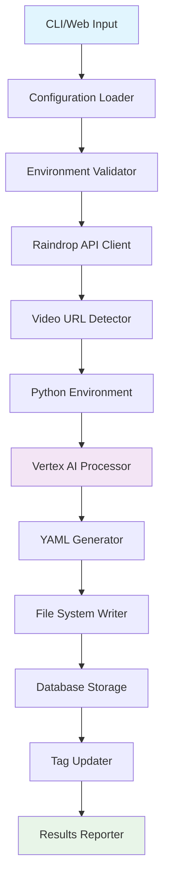

# 🌧️ Raindrop Video Summarizer

[](https://deno.land/)
[](https://python.org/)
[](LICENSE)

An intelligent video summarization tool that automatically processes YouTube videos from your Raindrop.io bookmarks using Google Cloud's Vertex AI (Gemini model). Features both a powerful CLI interface and a modern web dashboard for managing video summarization workflows.

## 🎯 What It Does

Transform your video bookmark collection into structured, searchable summaries with AI-generated tags and comprehensive metadata. Perfect for researchers, content creators, and anyone who saves videos for later reference.

## ✨ Features

### 🔧 Core Functionality
- **🤖 AI-Powered Summarization**: Uses Google Cloud Vertex AI (Gemini) for intelligent video analysis
- **🏷️ Smart Tag Generation**: Automatically generates 5-10 relevant tags from video content
- **📊 Rich Metadata**: YAML front matter with comprehensive video details and timestamps
- **🔄 Automatic Sync**: Updates Raindrop bookmarks with AI-generated tags
- **📝 Structured Output**: Professional markdown summaries with consistent formatting

### 🖥️ Interface Options
- **💻 CLI Interface**: Rich command-line experience with colorized output and progress tracking
- **🌐 Web Dashboard**: Modern web interface for managing summarization jobs and viewing results
- **📱 Real-time Updates**: Live progress tracking and notifications via WebSocket

### 🔌 Integration & Setup
- **🌧️ Raindrop.io Integration**: Seamless API integration with rate limiting and error handling
- **🐍 Python Auto-Detection**: Automatically detects pipx, conda, and system Python installations
- **⚙️ Interactive Setup**: Setup wizard with validation and helpful error messages
- **🗄️ Database Storage**: SQLite database for tracking processed videos and job history

### 🎛️ Advanced Features
- **🔍 Smart Filtering**: Filter by collections, tags, or custom criteria
- **🎯 Flexible Processing**: Batch processing with configurable limits and dry-run mode
- **📊 Progress Tracking**: Detailed logging with multiple verbosity levels
- **🔄 Resume Capability**: Resume interrupted processing sessions
- **⚡ Performance**: Efficient processing with concurrent job handling

## 📋 Prerequisites

Ensure you have the following before getting started:

### Required Software
- **[Deno](https://deno.land/)** (v1.45+) - JavaScript/TypeScript runtime
- **Python** (3.8+) - For AI processing
- **[pipx](https://pypa.github.io/pipx/)** (recommended) - For isolated Python package installation

### Required Accounts & Services
- **[Google Cloud Platform](https://cloud.google.com/)**
  - Project with Vertex AI API enabled
  - Authentication configured (service account or `gcloud auth`)
- **[Raindrop.io](https://raindrop.io/)** account with API access

### Quick Installation
```bash
# Install Deno (macOS/Linux)
curl -fsSL https://deno.land/install.sh | sh

# Install pipx
pip install pipx

# Install Python dependencies
pipx install "google-cloud-aiplatform[vertexai]"
pipx inject google-cloud-aiplatform pyyaml
```

## ⚙️ Setup

### 1. Clone & Navigate
```bash
git clone <repository-url>
cd raindrop-agent
```

### 2. Environment Configuration

Create a `.env` file in the project root:

```bash
# Required
RAINDROP_TOKEN="your_raindrop_api_token"
GOOGLE_CLOUD_PROJECT_ID="your_google_cloud_project_id"

# Optional
RAINDROP_COLLECTION_ID=0  # 0 = All bookmarks, or specific collection ID
MAX_VIDEOS=5              # Max videos per run
```

#### 🔑 Getting Your API Tokens

**Raindrop.io API Token:**
1. Go to [Raindrop.io Settings](https://app.raindrop.io/settings/integrations)
2. Click "Create new app"
3. Generate and copy your API token

**Google Cloud Setup:**
1. Create a [Google Cloud Project](https://console.cloud.google.com/)
2. Enable the [Vertex AI API](https://console.cloud.google.com/apis/library/aiplatform.googleapis.com)
3. Set up authentication:
   ```bash
   # Option 1: Application Default Credentials
   gcloud auth application-default login
   
   # Option 2: Service Account (for production)
   export GOOGLE_APPLICATION_CREDENTIALS="path/to/service-account.json"
   ```

**YouTube API Setup (Optional):**
1. Go to [Google Developers Console](https://console.developers.google.com/)
2. Enable YouTube Data API v3
3. Create API credentials (API Key)
4. Add the key to your `.env` file

### 3. Dependency Installation

The application auto-detects Python environments in this order:
1. **pipx** environments (recommended)
2. **conda** environments
3. **system** Python

```bash
# Recommended: pipx installation
pipx install "google-cloud-aiplatform[vertexai]"
pipx inject google-cloud-aiplatform pyyaml

# Alternative: pip installation
pip install "google-cloud-aiplatform[vertexai]" pyyaml
```

### 4. Verify Setup
```bash
# Test configuration and connections
./run.sh --dry-run --verbose
```

## 🚀 Usage

### CLI Interface

#### Quick Start
```bash
# Process 5 videos with default settings
./run.sh

# Alternative methods
deno task start              # Using Deno tasks
deno run --allow-all main.ts # Direct Deno command
```

#### Command Options
| Option | Description | Example |
|--------|-------------|---------|
| `-h, --help` | Show detailed help and examples | `./run.sh --help` |
| `-v, --version` | Display version information | `./run.sh --version` |
| `-t, --tag <tag>` | Process only bookmarks with specific tag | `./run.sh --tag programming` |
| `-c, --collection <id>` | Target specific Raindrop collection | `./run.sh --collection 123456` |
| `-n, --max-videos <num>` | Limit number of videos to process | `./run.sh --max-videos 10` |
| `-o, --output <path>` | Custom output directory | `./run.sh --output ./my-summaries` |
| `--config <file>` | Load configuration from file | `./run.sh --config ./custom.env` |
| `--dry-run` | Preview what would be processed | `./run.sh --dry-run --verbose` |
| `--verbose` | Enable detailed logging | `./run.sh --verbose` |
| `--quiet` | Minimize output (errors only) | `./run.sh --quiet` |

#### Usage Examples
```bash
# Basic usage
./run.sh

# Process specific tag with limit
./run.sh --tag "machine learning" --max-videos 15


# Dry run to preview
./run.sh --dry-run --verbose

# Custom collection and output
./run.sh -c 789012 -o ./research-summaries

# Development with file watching
deno task dev
```


### Web Interface

Launch the web dashboard for a visual interface:

```bash
# Start web server
deno task web

# Development with auto-reload
deno task web-dev
```

Access the dashboard at `http://localhost:3000` for:
- 📊 Job queue management
- 📱 Real-time progress tracking  
- 📚 Summary browsing and search
- ⚙️ Configuration management

### Processing Workflow

When you run the application, it:

1. **🔍 Discovery**: Fetches bookmarks from Raindrop.io
2. **🎥 Detection**: Identifies YouTube video URLs and extracts metadata 
3. **🤖 Analysis**: Generates AI summaries and tags using Vertex AI
4. **💾 Storage**: Saves structured markdown files with YAML metadata
5. **🔄 Sync**: Updates Raindrop bookmarks with generated tags
6. **📊 Reporting**: Provides detailed statistics and results

## 📄 Output Format

### File Structure
```
summaries/
├── dQw4w9WgXcQ-never_gonna_give_you_up.md
├── FLpS7OfD5-s-why_mcp_really_is_a_big_deal.md
└── UgHbHqg_Wmo-tmux_agents_are_here.md
```

### Content Features

Each generated summary includes:

- **📊 YAML Front Matter**: Structured metadata with video details and tags
- **🏷️ AI-Generated Tags**: 5-10 relevant tags based on content analysis  
- **📝 Professional Summary**: Executive summary, detailed breakdown, and key takeaways
- **🔄 Automatic Sync**: Tags automatically added to your Raindrop bookmarks
- **📈 Quality Assessment**: Content rating and practical applicability scores
- **🎯 Target Audience**: Prerequisites and recommended background knowledge

### Example Output

```yaml
---
title: "Building Modern AI Applications with TypeScript"
url: "https://youtube.com/watch?v=dQw4w9WgXcQ"
platform: "YouTube"
video_id: "dQw4w9WgXcQ"
generated: "2025-01-25T18:00:44.123456"
raindrop_created: "2024-01-15T10:30:00.000Z"
domain: "youtu.be"
tags:
  - typescript
  - ai-development
  - machine-learning
  - tutorial
  - programming
  - web-development
---

# 📹 Building Modern AI Applications with TypeScript

> **Video URL**: https://youtube.com/watch?v=dQw4w9WgXcQ  
> **Generated**: 2025-01-25  
> **Platform**: YouTube

---

## 🎯 Executive Summary
Comprehensive guide to building AI-powered web applications using TypeScript, covering modern frameworks, best practices, and deployment strategies for production-ready systems.

---

## 📋 Key Information

| **Aspect** | **Details** |
|------------|-------------|
| **Duration** | 45 minutes |
| **Speaker/Creator** | Jane Developer |
| **Main Topic** | TypeScript AI Development |
| **Content Type** | Tutorial/Walkthrough |
| **Difficulty Level** | Intermediate |

[... comprehensive structured content continues ...]
```

## 🏗️ Project Architecture

### Directory Structure
```
raindrop-agent/
├── 📁 src/                          # Modular TypeScript source
│   ├── 📄 types.ts                  # Shared interfaces & types
│   ├── 📁 config/
│   │   └── config.ts                # Configuration management
│   ├── 📁 utils/
│   │   ├── logger.ts                # Enhanced logging system
│   │   ├── yaml-parser.ts           # YAML processing utilities
│   │   └── tag-updater.ts           # Raindrop tag management
│   ├── 📁 api/
│   │   └── raindrop.ts              # Raindrop.io API client
│   ├── 📁 video/
│   │   ├── detector.ts              # Video URL detection
│   │   └── python-integration.ts    # Python environment detection
│   ├── 📁 cli/
│   │   └── cli.ts                   # Command-line interface
│   ├── 📁 web/                      # Web interface components
│   │   ├── server.ts                # Web server & API routes
│   │   ├── 📁 services/             # Job queue & real-time services
│   │   ├── 📁 models/               # Data models & schemas
│   │   └── 📁 middleware/           # Authentication & middleware
│   └── 📁 db/
│       └── database.ts              # SQLite database operations
├── 📄 main.ts                       # CLI application entry point
├── 📄 video_summarizer.py           # AI summarization engine
├── 📄 deno.json                     # Deno configuration & tasks
├── 📄 run.sh                        # Convenience shell script
├── 📄 .env                          # Environment configuration
├── 📁 summaries/                    # Generated markdown summaries
├── 📁 data/                         # SQLite database storage
└── 📁 docs/                         # Project documentation
```

### Core Components

#### 🎛️ Configuration & Setup
- **Interactive Setup Wizard**: Guides users through initial configuration
- **Environment Validation**: Checks API tokens, Python dependencies, and permissions
- **Multi-Environment Support**: Development, production, and testing configurations

#### 🔌 API Integration Layer
- **Raindrop.io Client**: Rate-limited API client with retry logic and error handling
- **Vertex AI Integration**: Google Cloud AI platform integration with authentication
- **Database Layer**: SQLite for job tracking, progress persistence, and metadata storage

#### 🎥 Video Processing Pipeline
- **Smart URL Detection**: Extracts video IDs from various YouTube URL formats
- **Python Environment Auto-Detection**: Supports pipx, conda, and system Python installations
- **Batch Processing**: Concurrent video processing with configurable limits and resume capability

#### 🖥️ User Interfaces
- **Rich CLI Experience**: Colorized output, progress bars, and interactive prompts
- **Web Dashboard**: Modern interface for job management, progress tracking, and summary browsing
- **Real-time Updates**: WebSocket integration for live progress and status updates

### Data Flow Architecture



1. **🔍 Input Processing**: Parse CLI arguments or web requests with validation
2. **⚙️ Configuration**: Load environment variables and validate API access
3. **🌧️ Data Fetching**: Retrieve bookmarks from Raindrop.io
4. **🎥 Video Detection**: Identify and validate YouTube video URLs with metadata extraction
5. **🤖 AI Processing**: Generate summaries and tags using Vertex AI
6. **💾 Content Generation**: Create structured markdown with YAML front matter
7. **🔄 Synchronization**: Update Raindrop bookmarks with generated tags
8. **📊 Reporting**: Provide detailed statistics and progress updates

## 🛠️ Development

### Available Tasks
```bash
# Development
deno task dev          # Run with file watching
deno task web-dev      # Web server with auto-reload

# Code Quality
deno task check        # Type checking
deno task fmt          # Format code
deno task lint         # Lint code

# Utilities
deno task help         # Show CLI help
deno task version      # Show version
deno task dry-run      # Preview processing
```

### Contributing
1. Fork the repository
2. Create a feature branch: `git checkout -b feature-name`
3. Make your changes and test thoroughly
4. Run code quality checks: `deno task fmt && deno task lint && deno task check`
5. Submit a pull request with a clear description

### Testing
```bash
# Test with dry run
./run.sh --dry-run --verbose

# Test specific scenarios
./run.sh --tag test --max-videos 1 --verbose

# Web interface testing
deno task web-dev
```

## 🤝 Support & Community

### Getting Help
- 📖 Check the [documentation](./docs/) for detailed guides
- 💬 Review existing [issues](https://github.com/your-username/raindrop-agent/issues) 
- 🐛 Report bugs with detailed reproduction steps
- 💡 Request features with clear use cases

### Common Issues

**Python Environment Issues:**
```bash
# Verify Python installation
which python3
python3 --version

# Check dependencies
pipx list | grep google-cloud-aiplatform
```

**API Connection Issues:**
```bash
# Test Raindrop.io connection
curl -H "Authorization: Bearer $RAINDROP_TOKEN" https://api.raindrop.io/rest/v1/user

# Verify Google Cloud authentication
gcloud auth list
```

**Permission Issues:**
```bash
# Make run script executable
chmod +x run.sh

# Check file permissions
ls -la summaries/
```

## 📝 License

MIT License - see [LICENSE](LICENSE) file for details.

## 🙏 Acknowledgments

- [Raindrop.io](https://raindrop.io/) for the excellent bookmarking API
- [Google Cloud Vertex AI](https://cloud.google.com/vertex-ai) for powerful AI capabilities
- [Deno](https://deno.land/) for the modern TypeScript runtime
- The open-source community for inspiration and tools

---

**Made with ❤️ for better video bookmark management**
